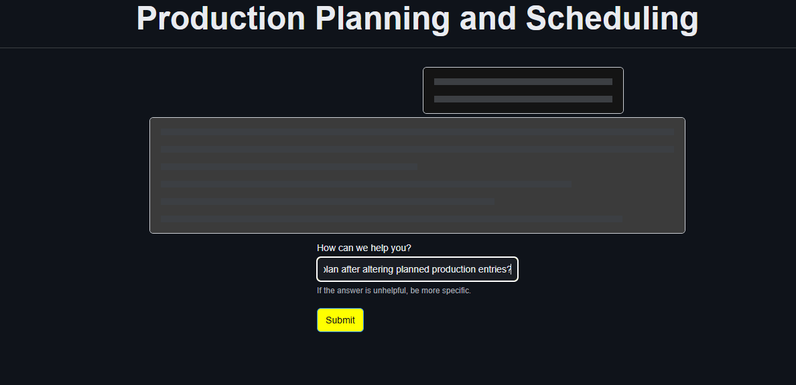
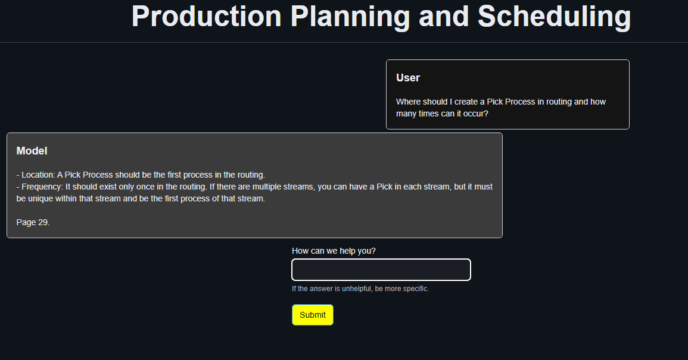
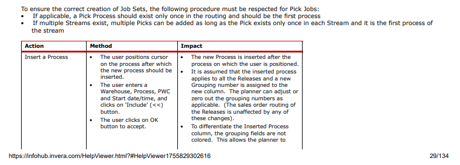

# manny

## Purpose
The purpose of this project is to create a full-stack web application where users can ask questions related to a PDF manual. The PDF is broken into chunks and stored in a vector database. Chunks are retrieved by similarity to the query and used to inform the LLM's response (RAG).

## Technologies used
- (fastapi)[https://fastapi.tiangolo.com/] - hosts the web application backend
- (react)[https://react.dev/] - frontend framework
- (rsuite)[https://rsuitejs.com/guide/introduction/] - React component library to help me build quickly
- (langchain)[https://www.langchain.com/] - scaffolding for the OpenAI API calls and vector store

## Result
The result is a simple full-stack application that answers our questions. I've included a few screenshots below to show the application in action and verify the result. In the first screenshot, we see the basic application. After submitting a question, text boxes with the loading effect populate the screen.

After a few moments, the answer is returned and the text boxes are populated with the question/answer pair.

As part of the code, the LLM is prompted to include the page number from which it drew relevant context. Here is a screenshot of page 29 of the manual to show the source.

As you can see, my application implements RAG to answer questions with information found in a PDF document. It's possible to continue asking questions and receiving answers on the same page.